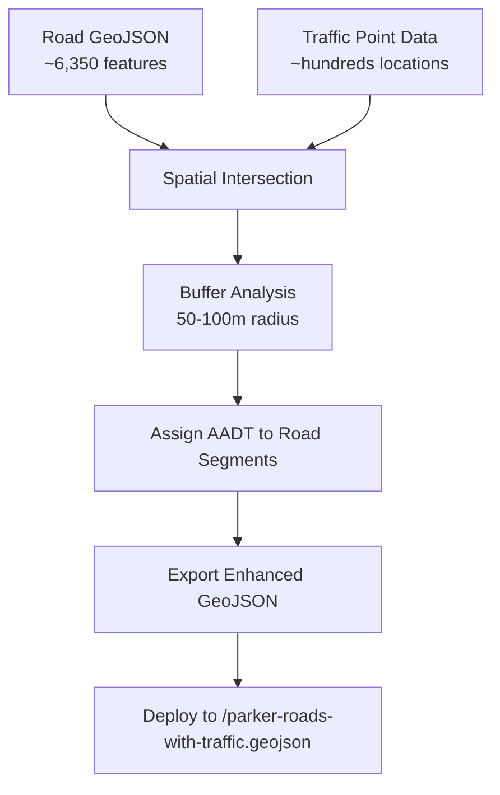

# Traffic-Road Gradient Layer Implementation Plan

## Overview

This document outlines the plan for creating a new map layer that combines Parker County road data with traffic count data to display roads with gradient colors and widths based on Annual Average Daily Traffic (AADT) values.

## Data Analysis Summary

### Current Data Assets
- **Road Segments**: ~6,350 road features (LineString geometries from TIGER/Line data)
- **Traffic Count Locations**: ~hundreds of point locations with AADT data
- **AADT Value Range**: 26 to 158,869 vehicles per day (6,100x difference - requires logarithmic scaling)
- **Data Sparsity**: Significant - most roads have no traffic data

### Traffic Data Structure
```json
{
  "properties": {
    "locationId": "184CC1",
    "locatedOn": "GS0000",
    "latestAadt": 8388,
    "latestAadtYear": 2024,
    "latestDhv30": 660,
    "latestKPercent": 8,
    "traffic": {
      "aadt": 8388,
      "dhv30": 660
    }
  }
}
```

## Implementation Strategy

### 1. Traffic Factor Selection
- **Primary Factor**: AADT (Annual Average Daily Traffic)
- **Rationale**: Most comprehensive and stable traffic metric
- **Fallback Options**: DHV30 (Design Hour Volume) for peak hour analysis

### 2. Gradient Approach
- **Type**: Logarithmic scaling (handles 6,100x AADT range effectively)
- **Behavior**: Roads without traffic data remain in default styling
- **Color Scheme**: Green (low) → Yellow (medium) → Red (high traffic)
- **Scale**: log₁₀ transformation for even visual distribution

### 3. Architecture: Two-Layer Approach

#### Layer 1: Base Roads Layer
```csharp
new LayerConfig
{
    Id = "parker-roads-base",
    Type = "GeoJson",
    DataUrl = "/parker-county-roads.geojson",
    Visible = true,
    Properties = new Dictionary<string, object>
    {
        ["stroked"] = true,
        ["filled"] = false,
        ["getLineColor"] = new int[] { 120, 120, 120, 128 }, // Gray
        ["getLineWidth"] = 1,
        ["lineWidthMinPixels"] = 1,
        ["opacity"] = 0.6,
        ["pickable"] = true
    }
}
```

#### Layer 2: Traffic Roads Overlay
```csharp
new LayerConfig
{
    Id = "parker-roads-traffic",
    Type = "Path",
    DataUrl = "/parker-roads-with-traffic.geojson",
    Visible = true,
    Properties = new Dictionary<string, object>
    {
        ["getPath"] = "getCoordinates",
        ["getColor"] = "getTrafficGradientColor",
        ["getWidth"] = "getTrafficWidth",
        ["widthMinPixels"] = 2,
        ["widthMaxPixels"] = 12,
        ["capRounded"] = true,
        ["jointRounded"] = true,
        ["opacity"] = 0.9,
        ["pickable"] = true,
        ["autoHighlight"] = true,
        ["onClick"] = "handleTrafficRoadClick"
    }
}
```

## Logarithmic AADT Scaling

Given the extreme range (26 to 158,869 AADT), logarithmic scaling provides optimal visual distribution:

```javascript
const LOG_AADT_THRESHOLDS = {
    // Log₁₀ ranges for even visual distribution
    VERY_LOW:  { logMin: 1.0, logMax: 2.0, aadt: [10, 100],     color: [0, 255, 0, 180],     width: 2 },     // Green
    LOW:       { logMin: 2.0, logMax: 2.7, aadt: [100, 500],    color: [128, 255, 0, 180],   width: 3 },     // Light Green
    MODERATE:  { logMin: 2.7, logMax: 3.3, aadt: [500, 2000],   color: [255, 255, 0, 180],   width: 4 },     // Yellow  
    HIGH:      { logMin: 3.3, logMax: 4.0, aadt: [2000, 10000], color: [255, 128, 0, 180],   width: 6 },     // Orange
    VERY_HIGH: { logMin: 4.0, logMax: 5.5, aadt: [10000, Infinity], color: [255, 0, 0, 180], width: 8 }      // Red
};

// Data range: log₁₀(26) = 1.4 to log₁₀(158,869) = 5.2
```

## JavaScript Implementation

### Logarithmic Gradient Color Function
```javascript
function getTrafficGradientColor(feature) {
    const aadt = feature.properties.traffic?.aadt || 0;
    if (aadt < 10) return [120, 120, 120, 128]; // Gray for very low/no data
    
    const logAADT = Math.log10(aadt);
    const minLog = 1.0;  // log₁₀(10) - practical minimum
    const maxLog = 5.2;  // log₁₀(158,869) - observed maximum
    
    // Normalize to 0-1 range
    const ratio = Math.min(Math.max((logAADT - minLog) / (maxLog - minLog), 0), 1);
    
    // Smooth color interpolation: Green → Yellow → Red
    const red = Math.floor(255 * ratio);
    const green = Math.floor(255 * (1 - ratio));
    
    return [red, green, 0, 180];
}
```

### Logarithmic Width Function
```javascript
function getTrafficWidth(feature) {
    const aadt = feature.properties.traffic?.aadt || 0;
    if (aadt < 10) return 1; // Minimal width for very low traffic
    
    const logAADT = Math.log10(aadt);
    const minLog = 1.0;  // log₁₀(10)
    const maxLog = 5.2;  // log₁₀(158,869)
    
    // Normalize and scale to width range
    const ratio = Math.min(Math.max((logAADT - minLog) / (maxLog - minLog), 0), 1);
    return 2 + (ratio * 8); // 2-10 pixel width range
}
```

## Data Processing Workflow

### Pre-Processing Pipeline


### Processing Steps
1. **Load Data Sources**
   - Road geometries: `/parker-county-roads.geojson`
   - Traffic points: `/parker_county_traffic_locations_*.geojson`

2. **Spatial Analysis**
   - Create 50-100m buffers around traffic count locations
   - Intersect buffers with road segments
   - Assign AADT values to intersecting road segments

3. **Data Enhancement**
   - Add traffic properties to matching road features
   - Preserve original road geometry and attributes
   - Filter to only roads with traffic data

4. **Export**
   - Generate `/parker-roads-with-traffic.geojson`
   - Deploy to web server for layer consumption

## Layer Configuration Updates

### MapLibreService.cs Changes
```csharp
// Add to GetDefaultLayers() method
new LayerConfig
{
    Id = "parker-roads-base",
    Type = "GeoJson",
    DataUrl = "/parker-county-roads.geojson",
    Visible = true,
    Properties = new Dictionary<string, object>
    {
        ["stroked"] = true,
        ["filled"] = false,
        ["getLineColor"] = new int[] { 120, 120, 120, 128 },
        ["getLineWidth"] = 1,
        ["opacity"] = 0.6
    }
},
new LayerConfig
{
    Id = "parker-roads-traffic",
    Type = "Path", 
    DataUrl = "/parker-roads-with-traffic.geojson",
    Visible = true,
    Properties = new Dictionary<string, object>
    {
        ["getColor"] = "getTrafficGradientColor",
        ["getWidth"] = "getTrafficWidth",
        ["widthMinPixels"] = 2,
        ["widthMaxPixels"] = 12,
        ["capRounded"] = true,
        ["jointRounded"] = true,
        ["pickable"] = true,
        ["autoHighlight"] = true
    }
}
```

### Layer Info Updates
```csharp
// Add to GetLayerInfo() method
new LayerInfo { Id = "parker-roads-base", Name = "Parker County Roads (Base)", Visible = true },
new LayerInfo { Id = "parker-roads-traffic", Name = "Parker County Roads (Traffic)", Visible = true }
```

## Benefits of This Approach

### Performance Advantages
- **Base layer**: Efficient rendering of all road segments
- **Traffic layer**: Only renders roads with traffic data (~hundreds vs thousands)
- **Native deck.gl**: Leverages WebGL for optimal performance
- **Logarithmic scaling**: Smooth gradients without performance impact

### User Experience Benefits
- **Clear visual hierarchy**: Gray roads show complete network context
- **No false information**: Avoids implying traffic levels where none exist  
- **Even distribution**: Log scaling ensures all traffic levels are visually represented
- **Intuitive**: Higher traffic = warmer colors and wider lines
- **Interactive features**: Click/hover capabilities maintained
- **Wide range handling**: Effectively displays both rural roads (26 AADT) and highways (158K+ AADT)

### Development Benefits
- **Modular design**: Layers can be toggled independently
- **Extensible**: Easy to add more traffic data sources
- **Maintainable**: Clear separation of concerns
- **Scalable**: Can handle additional counties/regions

## File Structure

### New Files Required
- `/parker-roads-with-traffic.geojson` - Enhanced road data with traffic properties
- Processing script (Python/Node.js) for data merging

### Modified Files
- `MapSandBox/Services/MapLibreService.cs` - Add new layer configurations
- `MapSandBox/wwwroot/js/maplibre-deckgl-integration.js` - Add traffic styling functions

## Implementation Timeline

1. **Phase 1**: Data processing script development
2. **Phase 2**: Enhanced GeoJSON generation  
3. **Phase 3**: Layer configuration updates
4. **Phase 4**: JavaScript styling function implementation
5. **Phase 5**: Testing and refinement

## Future Enhancements

- **Temporal Analysis**: DHV30-based peak hour visualization
- **Interactive Thresholds**: User-configurable AADT ranges
- **Data Updates**: Automated refresh from TCDS sources
- **Additional Metrics**: Speed data, classification data integration
- **Regional Expansion**: Additional Texas counties

---W

*Generated: 2025-08-06*  
*Status: Planning Complete - Ready for Implementation*W